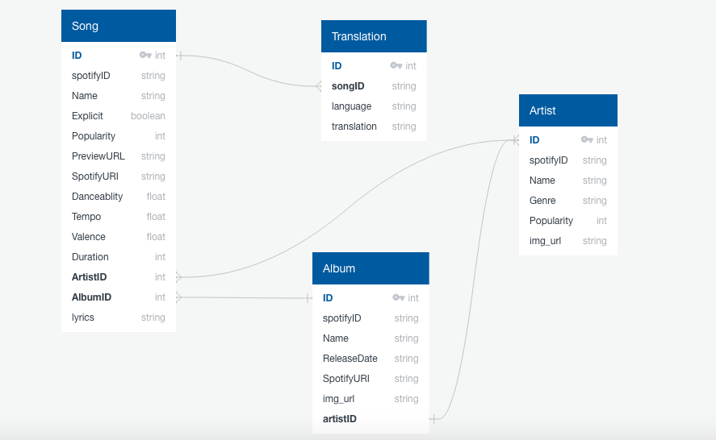

##LYRCS

**LINK**

https://lyrcsfrontend.herokuapp.com/

**About**

LYRCS is a web app that displays lyrics for a song in it's original language as well as a translated language of the user's choice. 

**Start Up Instructions From CL**

* cd to the Folder where you would like to store project files and run the git command: git clone https://github.com/LouisGaravaglia/iTranslate.git
* command: cd itranslate
* command: psql 
* create the database to updload starter data in the dump.sql file: CREATE DATABASE new_itranslatedb;
* exit out of the psql interface: (control + d) 
* move into the Backend folder: cd Backend
* command: psql new_itranslatedb < dump.sql
* while in the Backend folder, create the .env file needed to access the IBM Translate API. Copy the text from the env.rtf file attached to the email. Run the following command in your terminal: echo 'PASTE TEXT HERE BETWEEN THE QUOTATIONS' > .env
* in your terminal, move back to the main project folder: cd ..
* in your terminal, move to the Frontend folder: cd Frontend
* in your terminal, move to the src folder: cd src
* while in the src folder, create the accessToken.js file needed to access the Spotify API. Run the following command in your terminal: touch accessToken.js
* open that file: open accessToken.js
* then paste the text from the acessToken.rtf file included in the email to the newly created acessToken.js file. Save the file after pasting and close it.
* in your terminal, move back to the Frontend folder to install dependencies: cd ..
* while in the Frontend folder, run: npm i
* in your terminal, move back to the main project folder: cd ..
* move to the Backend folder now: cd Backend
* while in the Backend folder, run to instal Backend dependencies: npm i
* while in the Backend folder, spin up the server: npm start
* open up a new terminal window and cd to the Frontend folder, and start up react as well: npm start
* this should now automatically open up a new browser tab where you’ll be taken to the site. If it doesn’t, you should be able to find it at: http://localhost:3000

Instructions for running tests:
* In the Backend folder, in your terminal, run the command: jest --runInBand
* In the Frontend folder, in your terminal, run the command: npm test

**Features**

LYRCS is designed to be more inline with the expressive and fluid quality of a lot of the music one might search for. 

The most obvious feature you will notice is the animating background color. This was to give a visual clue that the section the user moved to contains different content then the previous and following ones. Also, it aligns with the changing of tempo an artist may direct, or the changing styles of music in genral.

A large search bar was implemented front and center on the landing page. This is to benefit what the majority of users want to acheive when they come to a lyrics webiste: Find the song they want to pull down lyrics for.

All sections when displaying results only display one result (artist, album, track, or genre) at a time. This is to not create a cluttered or overwhelming amount of information. When the user would like to see more results there is a slider in place of traditional pagination buttons. This allows for quick scrolling from beginning to end, and can also be used with arrow keys for a more indiviualized experience.

**Testing**

Frontend tests are located in the src folder next to each component which it tests. To run Frontend tests, cd to the Frontend folder and run the command: npm test

Backend tests are located in the routes folder next to each route which it tests. To run Backend tests, cd to the Backend folder and run the command: jest --runInBand --coverage

**User Flow**

On first load to the main url, users will see a search bar with the prompt "Find your song!". A user can type anything from just an artist name, to just a song or album name, and it utilizes Spotify's search endpoint to query their datbase for the top 20 best results.

The viewport will automatically scroll down to the next container and will then be displayed those results. 

Once the user finds the song they would like lyrics for and click it, a call is made to the Lyrics API to get the lyrics and the viewport will scroll down to the next section to pick which language they would like those lyrics translated to. 

After entering a language that they would like a translation (up to 65 languages are supported) to, a backend call to the IBM Watson Language Translator API will then get the translation.

The viewport then scrolls down one more time to display that translation next to the original lyrics received from a call to the Lyrics API.

**Tech Stack**

I will be using React / Redux / Node / Javascript / Express / PostgreSQL / JWT / Spring-React.

**User Demographic**

Teen to twenty somethings. Users who are looking for a more UX forward approach to finding song lyrics with translations.

**APIs**

Spotify API: https://developer.spotify.com/documentation

Lyrics API: https://lyricsovh.docs.apiary.io/#reference/0/lyrics-of-a-song/search?console=1

IBM Watson Translation API: https://www.ibm.com/watson/services/language-translator/

Spotify's API is used to get search results based on the user's search request. This will then get the intial song info needed as well to get future song data utilized spotify's unique ids for each song, album, and artist.

Lyrics API is used to get the lyrics for the song. It require the artist name and song name.

IBM Watson Translation API is used to translate the lyrics. They provide over 60 languges to translate to and lucikly have a pretty effective source text read feature where you don't need to explicitly say what language the source text is in ordet to translate to the desired target text.

**Database Schema**

**Stretch Goals**

I have a couple stretch goals. One is having user profiles where a user can update a translation to be more accurate. Another would be to imbed music videos of the songs using YouTube’s API. Implementing a typeahead searchbar would be great as well.

**Project Roadmap**

Core Functionality: Need to be able to gather song/artist details (Genre, Popularity, Tempo, Release Year, etc) in order to be able to sort songs in database. Need to be able to take that artist name and song name in order to make an API call to get song lyrics. Store those lyrics with artist/song details in database. Make a call to Translation API to get translated lyrics and store with artist/song details in DB. Display all of the above on a single page to the user.

Phase 1: Create a backend using Express to create Models and routes to make API requests and queries using pg to then insert into DB.

Phase 2: Create a database using PostgreSQL to store artist and song entries.

Phase 3: Be able to make successful API calls to Spotify API in order to get artist and song info. Then be able to store that info in DB, and use it to make successful call to Lyrics API. Use that result to be able to make successful call to IBM Translation API. Store all to DB.

Phase 4: Make a React Front End. Simplify it to have one component with a search bar asking for query, a confimration component display results to confirm the artist and song (whether that was found already in our DB, or pulled down from Spotify API). Then a display component to show the results.

Phase 5: Refine React components/structure and implement sorting ability to search by genre/tempo/etc for entries already in DB.

Extenstions: Youtube Music Video to be embeded on lyrics page. More complex searching ability. Linking either lyrics or artist/song details to listen on your spotify account. Possibly embed spotify player instead of Youtube Music Video.